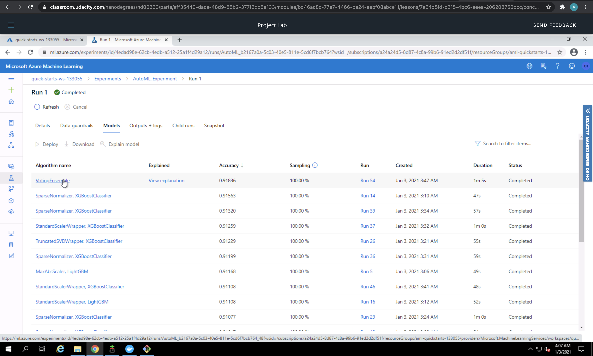

# Operationalizing Machine Learning using Azure ML

In this project we are provided a dataset: <b> [Bank Marketing dataset](https://automlsamplenotebookdata.blob.core.windows.net/automl-sample-notebook-data/bankmarketing_train.csv) </b>  

First an AutoML experiment was created and run to find the best model. 
The problem is to predict whether the clients end up subscribing to the product being advertised by the bank. 
This model is then deployed as a REST endpoint so that others can query it and get a prediction. 
For Debugging and Monitoring purposes the logging was enabled. 
Using OpenAPI Docs the Swagger files was displayed which provides information on how to consume the endpoints.

## Architectural Diagram

Here is an architectural view of the project:

## Key Steps

### Creating a service principal

I skipped this step because I was using the Lab provided by Udacity. I am not authorized to create a security principal. 

### Getting the data

The data to be used from this project is at the link [Bank Marketing dataset link](https://automlsamplenotebookdata.blob.core.windows.net/automl-sample-notebook-data/bankmarketing_train.csv) and uploaded in the Azure Datasets.
The screen shot below shows the registered dataset

On reviewing the registered dataset you see the following information

You can see the size of the dataset in the screen shot.

### Setting up and running the AutoML Experiment

To run an AutoML Experiment we first need to create a Compute cluster. 
After the creation of the cluster, an AutoML Experiment is created. 
The experiment is run using Classification with a primary metric of ``AUC_weighted`` on the dataset.

### Selecting the best performing model

Once the automated ML step is completed, the best performing model can be selected. 
In this case the best performing model is (``VotingEnsemble``).

Here is the list of the models that the AutoML had run and we can see the accuracy metrics for them.

### Deploying the best performing model

Now the best performing model is deployed. 
While deploying the model ``ACI (azure container instance)`` is selected and ``Authentication`` is enabled for the deployment.

### Setup logging

I have enabled logs using logs.py script in which I have used ``service.update(enable_app_insights=True)`` to enable the logging for the deployed model endpoint.
This is particularly useful because it can help us debug errors that may arise (503 for example which is usually the result of an unhandled exception.)
Then the script is run producing the output as shown in the screenshot below:

This enables ``Application Insights`` as you can see in the screenshot below

### Endpoint documentation using OpenAPI(Swagger)

Documenting the endpoint is very important. 
Documentation provide information on the type of requests that can be made on the endpoints available for consumption, the type of input or data expected with a sample.
First The Swagger shell script was run to download the Swagger Container and to run my Swagger File.

This Shell script runs a sample Swagger page, which is created from the Container as shown below:

Now the Swagger.json file is downloaded, and the serve.py script is run, so we can access the Swagger page for the endpoint.

Here we can see the Get endpoint, which is useful to check if the endpoint is running or not.

Here we can see the details of the POST endpoint, which is useful to check on how to query this API Endpoint and what information needs to be included in the payload.

### Consume the endpoint

The script found in ``endpoint.py`` is modified to consume the endpoint to make prediction. 
The score url and primary key is pasted in the script.
The endpoint script is run which makes post requests to the endpoint with some data to make prediction.

### Benchmark the endpoint

The benchmark shell script is run. The result is as shown below.

### Create, Publish and Consume a Pipeline
Using the Jupyter notebook provided in the starter files a pipeline is created. It uses the same dataset as before. 
After the execution of all the cells a pipeline is created and deployed for consumption.
The steps executed in the notebook are as follows:
1. An AutoML model is trained using the Bank Marketing dataset we used for project 1.
2. In this case, however, we create a Pipeline, to automate the process and be able to repeat the process at any time.
3. Next, we examine the metrics and the best model, which used the Voting Ensemble algorithm.
4. Then, we test the model and examine the confusion metrics.
5. After that, we publish the pipeline to generate a REST endpoint that allows us to rerun the pipeline at any time using any tool that can submit HTTP requests like POSTMAN.
6. Finally, we send a request to the REST endpoint to rerun the pipeline.

Here is a screenshot showing that the pipeline run has been completed with the dataset and the auto_ml module:

Here's a screenshot of the pipeline published

## Screen Recording

[Here](https://youtu.be/nwne3xSCIMM) is a screencast showing the project in action.

## Standout Suggestions

### Improve on the project

Some ways to improve this project are:
- Handle Class Imbalance as shown in the image below
  

- The data contains many outliers. The outliers affect the model performance.

- Remove unnecessary or irrelevant columns that aren't contributing a lot to the model.

- An automated CI/CD pipeline can be set up so that with every new trained model it can be deployed automatically and used by the user.